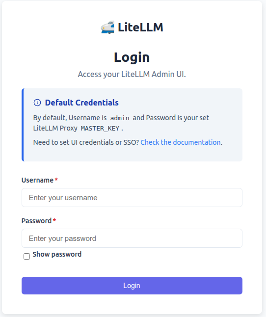
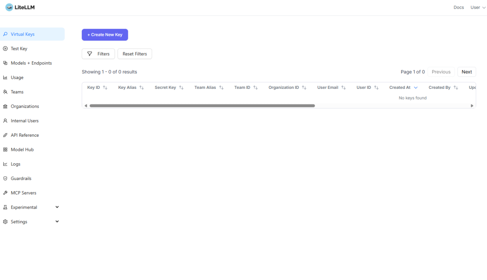
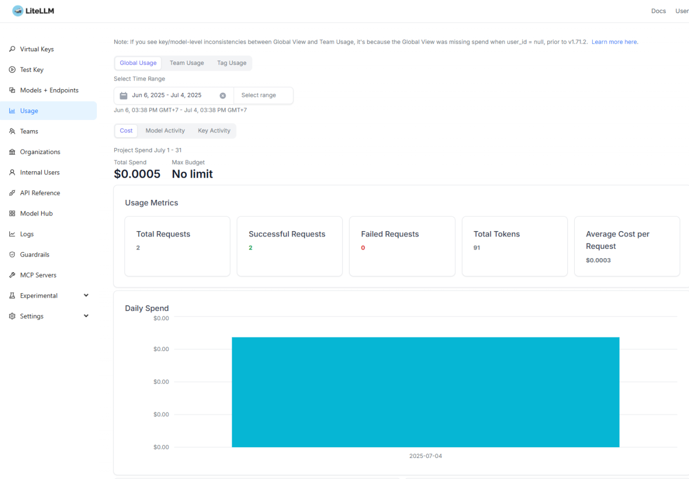
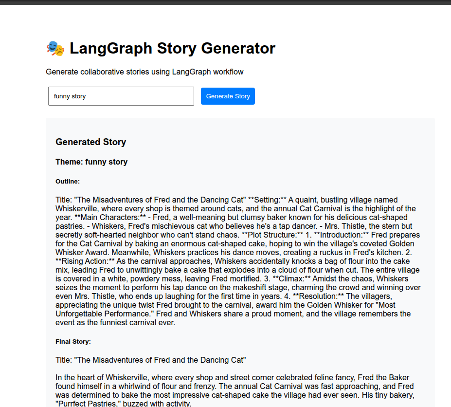
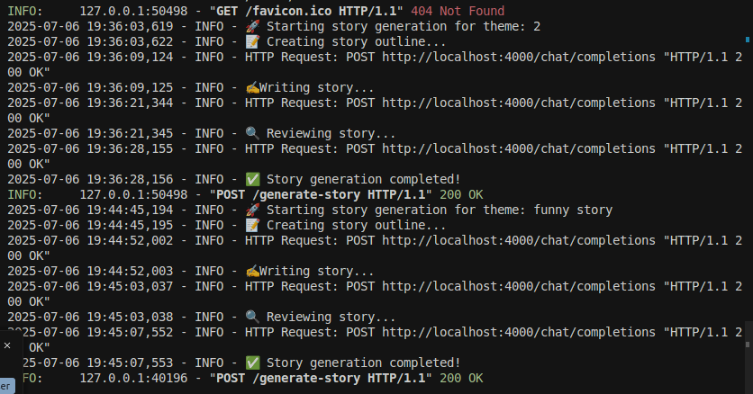
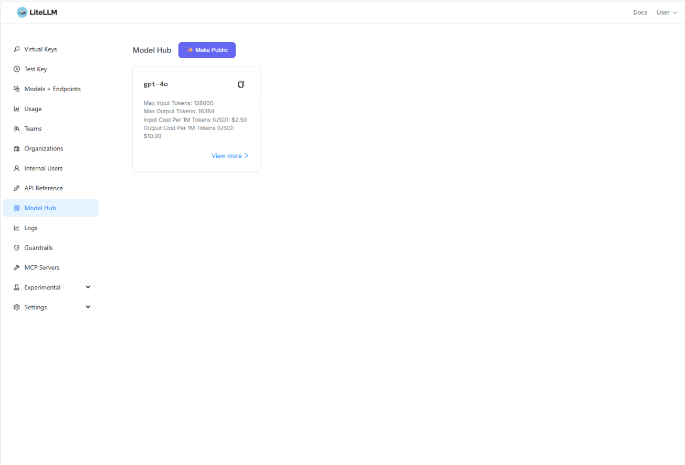
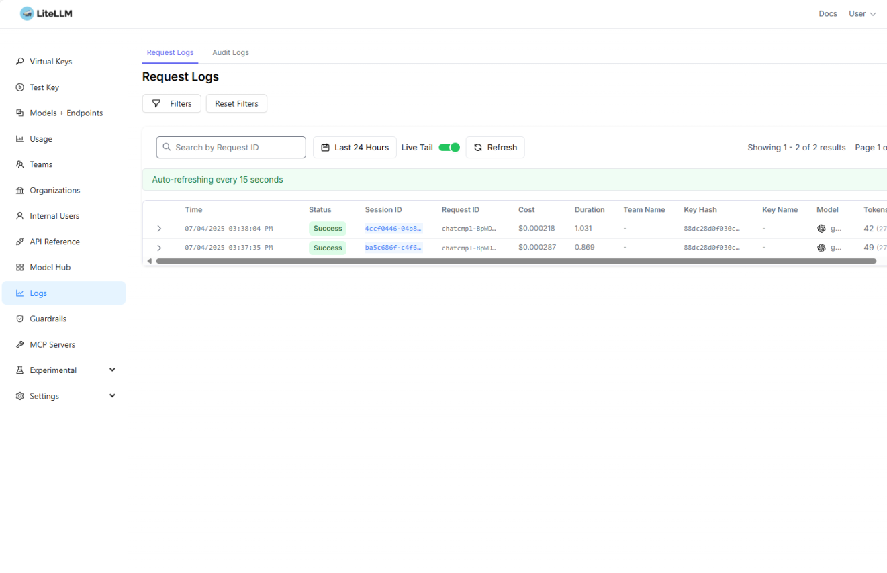

# LiteLLM and LangGraph Story Generator Demo

This directory contains a practical example demonstrating how to build a LangGraph workflow that integrates with LiteLLM proxy for story generation.

## 🚀 Quick Start

### 1. Setup Environment

```bash
# Install uv if not already installed
curl -LsSf https://astral.sh/uv/install.sh | sh

# Create and activate virtual environment
uv venv
source .venv/bin/activate  # Linux/Mac

# Install all dependencies
uv sync
```

### 2. Start LiteLLM Proxy

```bash
# Install LiteLLM
uv add litellm

# Start the proxy with configuration
litellm --config config.yaml
```

The proxy will start and be available at:
- **Web UI**: http://localhost:4000/ui  
- **API endpoint**: http://localhost:4000


*Initial LiteLLM proxy login screen*


*LiteLLM proxy dashboard showing available models and status*


*Usage tracking and analytics in the LiteLLM interface*

### 3. Run the Story Generator Demo

```bash
uv run simple_langgraph_demo.py
```

Then visit **http://localhost:8000** to see the interactive story generator!

## 🎭 What the Demo Shows

The **Story Generator** demonstrates core LangGraph concepts through a simple 3-step workflow:

### Workflow Steps
1. **Create Outline** - Generate a story structure from a theme
2. **Write Story** - Create a full story based on the outline  
3. **Review Story** - Polish and improve the final story


*Example output showing the complete story generation workflow with theme, outline, story, and final polished version*

### LangGraph Workflow Execution


*Console logs showing the LangGraph workflow execution steps and state transitions*

### Key LangGraph Features Demonstrated
- **State Management** - How data flows between workflow steps
- **Sequential Nodes** - Building linear workflows with dependencies
- **LiteLLM Integration** - Using proxy for model calls
- **Error Handling** - Robust error management in workflows

## 📁 Files Overview

### Configuration Files
- `config.yaml` - LiteLLM proxy configuration
- `pyproject.toml` - UV project dependencies

### Demo Script
- `simple_langgraph_demo.py` - Complete story generator with FastAPI web interface

## 🔧 Configuration

### Models
The demo uses `gpt-4o` by default. To change models:
1. Update `config.yaml` with your preferred model
2. Modify `DEFAULT_MODEL` in the demo script


*LiteLLM model hub showing available models and their configurations*

### Proxy Settings
- Default URL: `http://localhost:4000`
- Timeout: 30 seconds
- API key: Uses placeholder key for local testing


*LiteLLM request logs showing API calls and responses*

## 🌐 Web Interface

The demo includes a web interface at http://localhost:8000 with:
- Theme input form
- Real-time workflow progress
- Display of outline, story, and final polished version
- Example themes to try

## 🐛 Troubleshooting

### Common Issues

**Connection Error to Proxy**
```
Failed to connect to LiteLLM proxy at http://localhost:4000
```
**Solution**: Start the proxy first:
```bash
litellm --config config.yaml
```

**API Key Errors**
```
HTTP error: 401
```
**Solution**: Check your API keys in `config.yaml`

**Module Not Found**
```
ModuleNotFoundError: No module named 'langgraph'
```
**Solution**: Install dependencies:
```bash
uv sync
```
