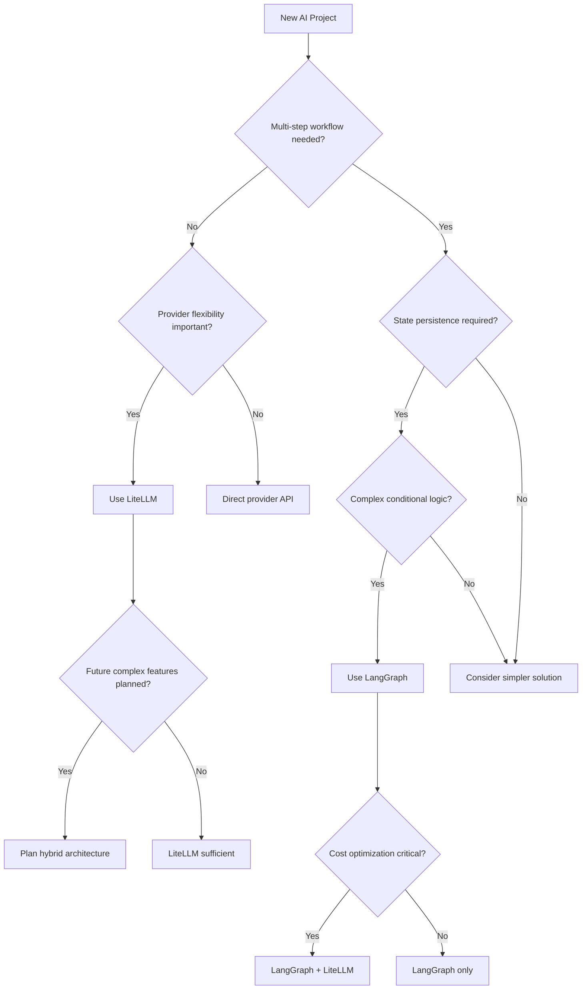

# LiteLLM vs LangGraph: Comprehensive Comparison

---

## Executive Summary

<details>
<summary>Key Differences and Strategic Overview</summary>

---

### Core Purpose Comparison

| Aspect | LiteLLM | LangGraph |
|--------|---------|-----------|
| **Primary Purpose** | LLM Provider Abstraction | Workflow Orchestration |
| **Core Strength** | Unified API across providers | Complex agent workflows |
| **Complexity Level** | Low to Medium | Medium to High |
| **Learning Curve** | Gentle (1-2 days) | Moderate (1-2 weeks) |
| **Best For** | Model switching, cost optimization | Multi-step reasoning, stateful apps |

### When to Use Each Tool

#### Choose LiteLLM When:
- **Provider flexibility** - need to switch between different LLM providers easily
- **Cost optimization** - want automatic routing to cheapest available models  
- **Simple integration** - replacing existing OpenAI API calls with minimal changes
- **Reliability needs** - require built-in fallbacks and retry mechanisms
- **Team scalability** - multiple developers need unified LLM access

#### Choose LangGraph When:
- **Complex workflows** - multi-step reasoning and decision making required
- **Stateful applications** - need to maintain context across interactions
- **Agent architecture** - building autonomous agents with tools and memory
- **Human-in-the-loop** - require approval workflows or human oversight
- **Dynamic routing** - workflows that change based on intermediate results

#### Use Both Together When:
- **Enterprise applications** - need both provider flexibility AND complex workflows
- **Production systems** - want reliability AND sophisticated agent logic
- **Cost and capability optimization** - route different workflow steps to optimal models

---

</details>

---

## Technical Feature Matrix

<details>
<summary>Detailed Capability Comparison</summary>

---

### Feature Comparison

| Feature | LiteLLM | LangGraph | Best Choice |
|---------|---------|-----------|-------------|
| **Provider Support** | ✅ 100+ providers | ⚠️ Via integrations | LiteLLM |
| **Unified API** | ✅ OpenAI-compatible | ❌ Graph-specific | LiteLLM |
| **Cost Optimization** | ✅ Built-in routing | ⚠️ Manual configuration | LiteLLM |
| **Retry/Fallbacks** | ✅ Automatic | ⚠️ Manual implementation | LiteLLM |
| **Workflow Orchestration** | ❌ Linear only | ✅ Complex graphs | LangGraph |
| **State Management** | ❌ Stateless | ✅ Built-in persistence | LangGraph |
| **Conditional Logic** | ⚠️ Limited | ✅ Native support | LangGraph |
| **Human-in-Loop** | ❌ Not supported | ✅ Built-in checkpoints | LangGraph |
| **Tool Integration** | ⚠️ Function calling only | ✅ Native tool nodes | LangGraph |
| **Learning Curve** | ✅ Minimal | ⚠️ Moderate | LiteLLM |

### Performance Characteristics

```python
# LiteLLM Performance Profile
strengths = {
    "latency_overhead": "< 50ms",
    "request_routing": "efficient",
    "caching": "built-in",
    "load_balancing": "automatic"
}

# LangGraph Performance Profile
strengths = {
    "state_management": "optimized",
    "graph_traversal": "efficient", 
    "checkpoint_recovery": "fast",
    "parallel_execution": "where possible"
}

# Typical overhead: LangGraph adds ~15-20% latency for graph orchestration
```

---

</details>

---

## Decision Framework

<details>
<summary>Practical Selection Guide with Examples</summary>

---

### Scenario-Based Decision Matrix

#### Scenario 1: Simple Chatbot
```python
# Requirements: Simple Q&A, provider flexibility, cost optimization
# Decision: LiteLLM

import litellm

def simple_chatbot(message, model="gpt-3.5-turbo"):
    response = litellm.completion(
        model=model,
        messages=[{"role": "user", "content": message}],
        fallbacks=["claude-3-sonnet-20240229", "gpt-4"]
    )
    return response.choices[0].message.content

# Why LiteLLM: No complex state, needs provider flexibility
# Why not LangGraph: Unnecessary overhead for simple interactions
```

#### Scenario 2: Multi-Step Research Agent
```python
# Requirements: Complex workflow, state persistence, conditional logic
# Decision: LangGraph

from langgraph.graph import StateGraph, END

class ResearchState(TypedDict):
    query: str
    search_results: List[Dict]
    analysis: str
    final_report: str

def search_node(state): # ... implementation
def analyze_node(state): # ... implementation  
def synthesize_node(state): # ... implementation

workflow = StateGraph(ResearchState)
workflow.add_node("search", search_node)
workflow.add_node("analyze", analyze_node)
workflow.add_node("synthesize", synthesize_node)
# ... workflow configuration

# Why LangGraph: Complex multi-step process with state
# Why not LiteLLM: Cannot handle stateful workflows
```

#### Scenario 3: Enterprise Content Generation
```python
# Requirements: Complex workflow + provider optimization + approval process
# Decision: LangGraph + LiteLLM (Hybrid)

def content_generation_node(state):
    # Use LiteLLM for provider flexibility within LangGraph
    response = litellm.completion(
        model=select_optimal_model(state["content_type"]),
        messages=state["messages"],
        fallbacks=["gpt-4", "claude-3-sonnet-20240229"]
    )
    return {"generated_content": response.choices[0].message.content}

# Why hybrid: Get both workflow orchestration AND provider optimization
```

### Decision Flowchart



---

</details>

---

## Integration Patterns

<details>
<summary>Best Practices for Combining Both Tools</summary>

---

### Pattern 1: LiteLLM within LangGraph Nodes

```python
from langgraph.graph import StateGraph, END
import litellm

class HybridState(TypedDict):
    messages: Annotated[List[BaseMessage], operator.add]
    cost_tracking: dict
    current_model: str

def smart_llm_node(state: HybridState):
    """LangGraph node using LiteLLM for optimal model selection."""
    
    # Analyze task complexity
    task_complexity = analyze_task(state["messages"][-1].content)
    
    # Select model based on complexity and cost
    model_map = {
        "simple": "gpt-3.5-turbo",
        "complex": "gpt-4", 
        "creative": "claude-3-opus-20240229"
    }
    
    selected_model = model_map.get(task_complexity, "gpt-3.5-turbo")
    
    # Use LiteLLM for execution with fallbacks
    response = litellm.completion(
        model=selected_model,
        messages=[msg.dict() for msg in state["messages"]],
        fallbacks=["gpt-3.5-turbo", "claude-3-sonnet-20240229"]
    )
    
    # Track costs
    cost = litellm.completion_cost(model=selected_model, usage=response.usage)
    
    return {
        "messages": [AIMessage(content=response.choices[0].message.content)],
        "cost_tracking": {
            **state.get("cost_tracking", {}),
            "latest_cost": cost
        },
        "current_model": selected_model
    }

def analyze_task(content: str) -> str:
    """Simple task complexity analysis."""
    if any(word in content.lower() for word in ["analyze", "complex", "detailed"]):
        return "complex"
    elif any(word in content.lower() for word in ["creative", "story", "poem"]):
        return "creative"
    else:
        return "simple"

# Create workflow
workflow = StateGraph(HybridState)
workflow.add_node("smart_llm", smart_llm_node)
workflow.set_entry_point("smart_llm")
workflow.add_edge("smart_llm", END)

hybrid_agent = workflow.compile()
```

### Pattern 2: Router-Based Architecture

```python
class IntelligentRouter:
    """Route workflow steps to optimal model configurations."""
    
    def __init__(self):
        self.step_configs = {
            "planning": {"model": "gpt-4", "temperature": 0.1},
            "research": {"model": "claude-3-sonnet-20240229", "temperature": 0.3},
            "synthesis": {"model": "gpt-3.5-turbo", "temperature": 0.7},
            "review": {"model": "gpt-4", "temperature": 0.0}
        }
    
    def execute_step(self, step_name: str, messages: List):
        config = self.step_configs.get(step_name, self.step_configs["synthesis"])
        
        response = litellm.completion(
            model=config["model"],
            messages=messages,
            temperature=config["temperature"],
            fallbacks=["gpt-3.5-turbo"]
        )
        
        return {
            "content": response.choices[0].message.content,
            "model_used": config["model"],
            "cost": litellm.completion_cost(model=config["model"], usage=response.usage)
        }

# Use in LangGraph workflow
router = IntelligentRouter()

def planning_node(state):
    result = router.execute_step("planning", state["messages"])
    return {"messages": [AIMessage(content=result["content"])]}

def research_node(state):
    result = router.execute_step("research", state["messages"])
    return {"messages": [AIMessage(content=result["content"])]}

# Build complete workflow with optimized routing
```

### Pattern 3: Resilience and Fallbacks

```python
class ResilientHybridAgent:
    """Maximum reliability combining both tools."""
    
    def __init__(self):
        self.circuit_breakers = {}
        self.fallback_models = {
            "gpt-4": ["gpt-3.5-turbo", "claude-3-sonnet-20240229"],
            "claude-3-opus-20240229": ["claude-3-sonnet-20240229", "gpt-4"]
        }
    
    def execute_with_resilience(self, model: str, messages: List, **kwargs):
        try:
            # Primary execution with LiteLLM fallbacks
            response = litellm.completion(
                model=model,
                messages=messages,
                fallbacks=self.fallback_models.get(model, ["gpt-3.5-turbo"]),
                num_retries=3,
                **kwargs
            )
            
            return {
                "success": True,
                "content": response.choices[0].message.content,
                "model_used": response.model
            }
            
        except Exception as e:
            # Emergency fallback
            try:
                emergency_response = litellm.completion(
                    model="gpt-3.5-turbo",
                    messages=[{"role": "user", "content": f"Fallback response needed: {messages[-1]['content']}"}],
                    max_tokens=150
                )
                
                return {
                    "success": False,
                    "content": emergency_response.choices[0].message.content,
                    "model_used": "gpt-3.5-turbo (emergency)",
                    "error": str(e)
                }
            except:
                return {
                    "success": False,
                    "content": "All systems temporarily unavailable",
                    "model_used": "none"
                }
```

---

</details>

---

## Implementation Roadmap

<details>
<summary>Migration Strategies and Team Guidelines</summary>

---

### Migration Path 1: LiteLLM First

```python
# Phase 1: Replace direct LLM calls (1-2 weeks)
# Before
import openai
response = openai.ChatCompletion.create(model="gpt-3.5-turbo", messages=messages)

# After  
import litellm
response = litellm.completion(model="gpt-3.5-turbo", messages=messages, fallbacks=["claude-3-sonnet-20240229"])

# Phase 2: Add optimization (1 week)
router = litellm.Router(model_list=[...], routing_strategy="least-busy")

# Phase 3: Identify complex workflows for LangGraph (2-3 weeks)
# Phase 4: Migrate complex cases to hybrid approach (3-4 weeks per workflow)
```

### Team Structure Recommendations

```python
team_roles = {
    "infrastructure_team": {
        "focus": "LiteLLM setup, provider management, cost optimization",
        "timeline": "2-3 weeks initial setup",
        "skills": ["DevOps", "API management", "cost optimization"]
    },
    
    "workflow_team": {
        "focus": "LangGraph implementation, agent design, complex logic",
        "timeline": "4-6 weeks for complex workflows", 
        "skills": ["Python", "graph theory", "agent design"]
    },
    
    "integration_team": {
        "focus": "Hybrid architectures, migration, performance",
        "timeline": "Ongoing 20-30% allocation",
        "skills": ["System architecture", "both tools", "migration"]
    }
}
```

### Success Metrics

```python
success_metrics = {
    "technical": {
        "cost_reduction": "20-40% via LiteLLM routing",
        "latency_overhead": "<10% from LangGraph",
        "error_rate": "<1% with fallbacks",
        "availability": "99.9% uptime"
    },
    
    "business": {
        "development_velocity": "50% faster for complex workflows",
        "feature_complexity": "Support multi-step workflows", 
        "time_to_market": "Faster AI feature delivery"
    },
    
    "team": {
        "proficiency": "Team trained in 4 weeks",
        "documentation": "100% critical path coverage",
        "incident_response": "<30 minute resolution"
    }
}
```

### Implementation Timeline

| Month | Focus | Deliverables |
|-------|--------|-------------|
| 1 | LiteLLM integration & training | Provider abstraction, cost optimization |
| 2 | LangGraph pilots & patterns | Simple workflows, hybrid architectures |
| 3 | Production deployment | Monitoring, alerting, documentation |
| 4 | Advanced features | Complex agents, optimization |
| 5+ | Scaling & improvement | New features, performance tuning |

---

</details> 